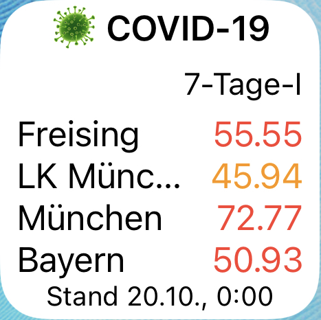

# ios-scriptable

Is a repository with some scripts for the [Scriptable App](https://scriptable.app/) on iOS

    

## Installation of a script

1. Download the [Scriptable App](https://apps.apple.com/us/app/scriptable/id1405459188?uo=4)
2. choose prefered script from list
3. copy the complete content of the file
4. start Scriptible and add new script with *+-Button* on top right
5. paste copied script
6. close editor with *done* on top left
7. long press new *Untitled Script* and rename to prefered name

## Install a script as widget

1. long press on screen with app icons until they are shaking
2. press *+* on top left
3. search for scriptable
4. add prefered widget size
5. tap empty widget
6. select name of script and set interacting to run script

## List of Scripts

* Covid-19
  * Widget 7 days incidence of area [widget_covid19_7day_incidence_areas.js](widget_covid19_7day_incidence_areas.js)
    
